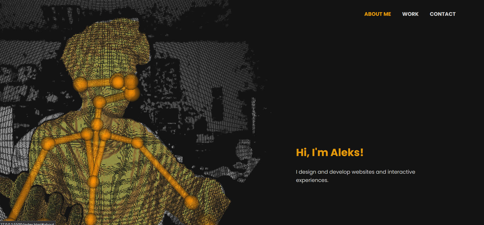
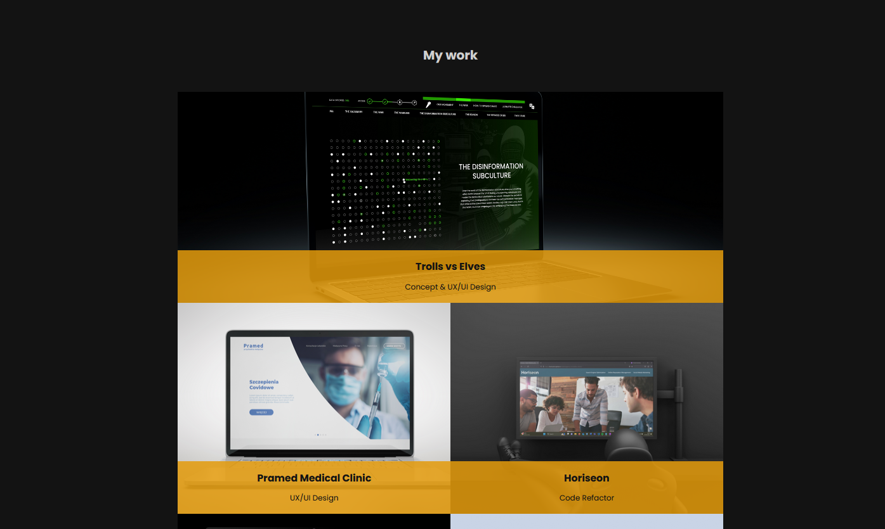
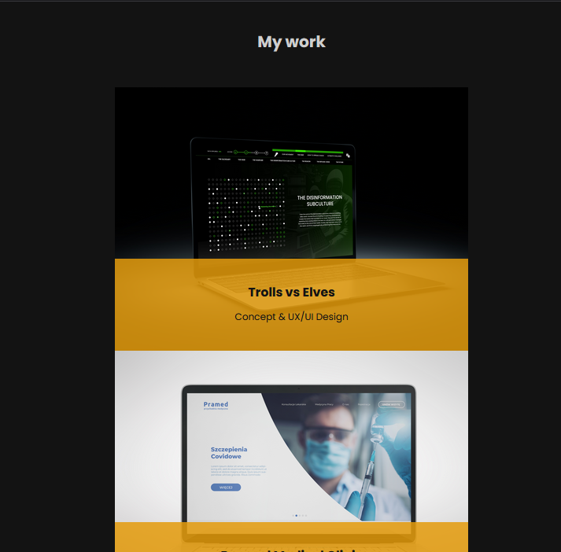
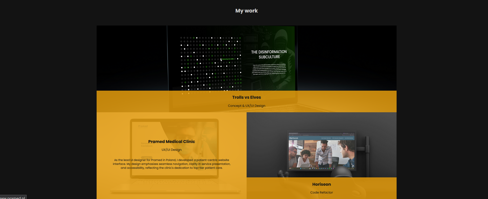
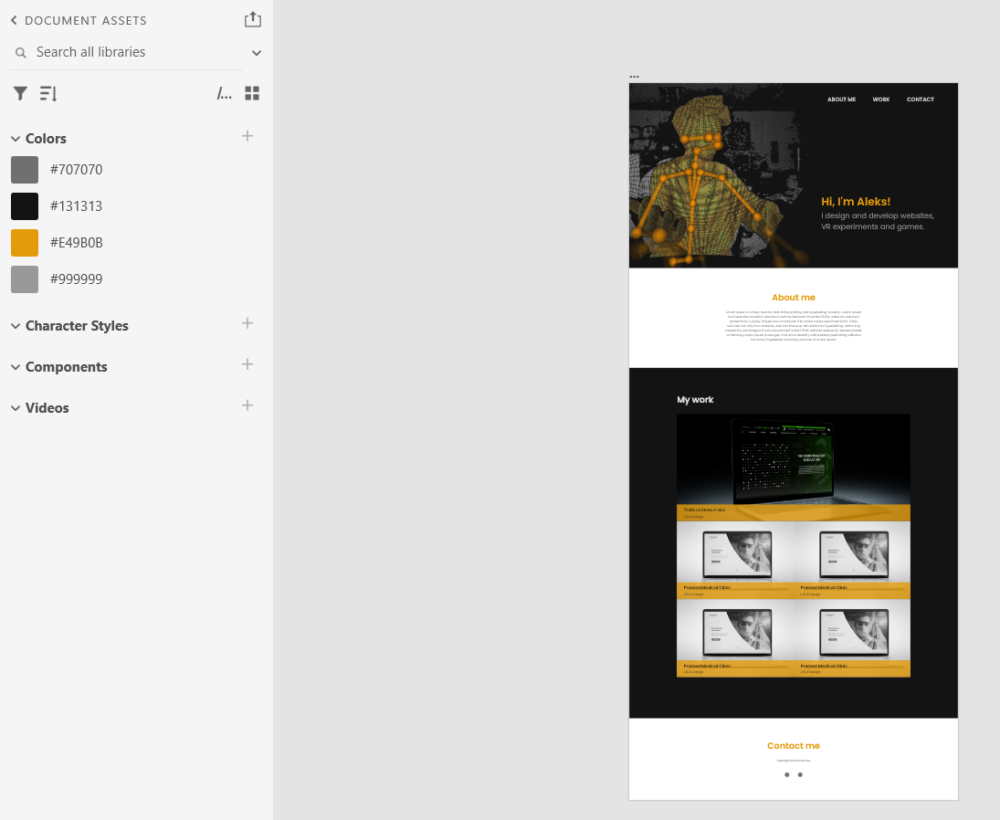

# Personal Portfolio 
Welcome to my personal portfolio repository! This represents my first attempt to develop a web-based portfolio, in which I showcase my skills and works related to web development and UI/UX design.

## 🚀 Live Version
Experience the live version of my portfolio: [Click here](https://)

## 📝 Description
This portfolio is a single-page website, hand-coded using HTML and CSS. The design layout was crafted in Adobe XD. Here are some of the standout features:  

#### Hero section with navigation
A full-width header combined with smooth navigation. Click on a navigation item, and it seamlessly scrolls you to the respective section.  
   

#### Grid with samples of my work
Neatly organized samples of my work in a responsive grid layout, ensuring an optimal experience regardless of the device's screen size. 
>*Desktop version of the work grid*  

>*Mobile version of the work grid*  

 

#### Overlays
Interactive overlays appear when you hover over a project, displaying a detailed description of the work.  

  

## 🎨 UI/UX Design
Website was designed in Adobe XD. Here's a sneak peek into the initial design:  

## ♿ Accessibility
I'm an advocate for digital inclusivity. With that in mind, this portfolio is built with semantic HTML structures, enhanced with `alt` and `aria-label` attributes to boost accessibility.

## 📜 License
This project is licensed under the [MIT License](https://choosealicense.com/licenses/mit/)

